# UAS Pemrograman Berbasis Kerangka Kerja

Nama          : Anargya Widyadhana

NRP           : 05111740000047

Mata kuliah   : Pemrograman Berbasis Kerangka Kerja

Kelas         : E

## Status Pengerjaan
100% Complete (Updated on 23/05/2020 22:46)

## Section
- [Instalasi](#instalasi)
- [Penjelasan Aplikasi](#penjelasan-aplikasi)
- [Penjelasan Fitur](#penjelasan-fitur)
    - [1. Halaman Home/Main Aplikasi](#1-halaman-home/main-aplikasi)
    - [2. Halaman About](#2-halaman-about)
    - [3. Halaman Login](#3-halaman-login)
    - [4. Halaman Register](#4-halaman-register)
    - [5. Halaman Rekapitulasi Semua Donasi](#5-halaman-rekapitulasi-semua-donasi)
    - [6. Halaman Detail Donasi](#6-halaman-detail-donasi)
    - [7. Halaman Tambah Donasi](#7-halaman-tambah-donasi)
    - [8. Halaman Donasi Per Kategori](#8-halaman-donasi-per-kategori)
    - [9. Logout](#9-logout)

## Instalasi
- Pertama, lakukan clone project ini.
- Sesuaikan setting database pada file `app/config/config.php` sesuai dengan database kalian.
- Lakukan migrasi tabel dengan `phalcon migration run`. Jika tidak bisa harap sesuaikan migration dengan versinya, versi terbaru adalah `1.0.2` di folder `app/migrations`.
- Lalu, kalian bisa membuat virtual host pada Web Server yang digunakan (untuk kali ini saya menggunakan Apache pada XAMPP Windows, dengan nama domain `donasi-dhana.local`). (opsional)
- Buka aplikasi di browser.

## Penjelasan Aplikasi
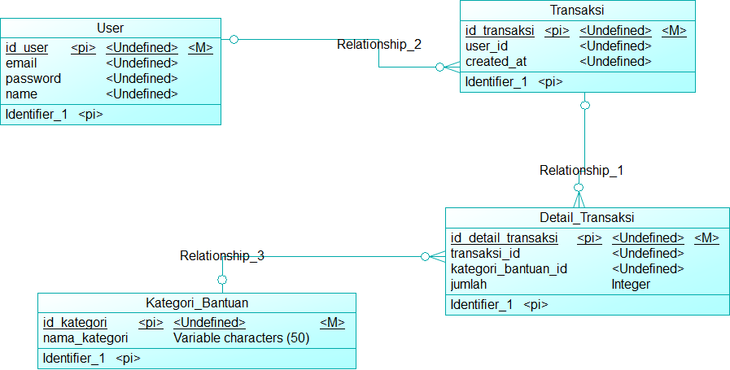
Donasi Dhana adalah aplikasi web dengan menggunakan framework Phalcon. Di sini digunakan `Phalcon Devtools` dalam membuat project aplikasinya. Aplikasi menggunakan template `Bootstrap`. Dalam aplikasi ini, terdapat sebuah fitur donasi, yaitu pengguna bisa melakukan registrasi pada aplikasi, melihat rekapitulasi semua donasi oleh semua user, melihat detail donasi dari daftar rekapitulasi tersebut, membuat donasi baru dengan dinamis (bisa banyak atau sedikit jenis barang dalam donasi), dan melihat detail donasi per kategori, dalam format tabel dan grafik.

Seperti pada CDM di atas, akan ada 4 tabel, dimana tabel transaksi berelasi dengan user pembuat, terdapat detail_transaksi karena dalam satu transaki bisa jadi ada banyak jenis bantuan yang diberikan, yang bisa sedikit atau banyak, dan mempunyai jumlah yang berbeda-beda. Sementara setiap detail transaksi hanya berasal dari satu transaksi dan satu kategori bantuan. Tabel kategori_bantuan untuk menyimpan kategori bantuannya, misal makanan, obat, masker, dll.

## Penjelasan Fitur
#### 1. Halaman Home/Main Aplikasi

Pada halaman ini, pengunjung bisa melihat halaman utama saat aplikasi dijalankan/web dibuka. Terdapat navbar di atas, berisi `Home` (menu ini), `About`, `Log In/Sign Up`. Dan terdapat petunjuk mengenai aplikasi di sini.

#### 2. Halaman About

Pada halaman ini, pengunjung bisa melihat profil dari pembuat yaitu saya sendiri.

#### 3. Halaman Login

Di sini, pengunjung bisa login untuk dapat melakukan donasi dan melihat menu-menu berikutnya. Jika belum mempunyai akun, bisa mendaftar di tombol `Sign Up`.

#### 4. Halaman Register

Di sini, pengunjung bisa mengisi form untuk melakukan pendaftaran. Setelah mendaftar akan meredirect ke halaman `Login` dan menampilkan pesan flash success.

Untuk halaman-halaman selanjutnya, hanya bisa diakses setelah login, jika tidak maka akan otomatis meredirect ke halaman `Home`. Proses pengecekan auth dan redirect dilakukan di controller.

#### 5. Halaman Rekapitulasi Semua Donasi

Di sini adalah halaman pertama yang muncul setelah proses login. Halaman ini menampilkan rekapitulasi semua donasi oleh semua user terdaftar pada aplikasi. Pada tabel, data disusun berdasarkan tiap-tiap transaksi, yang menunjukkan nama donatur, kategori yang dipilih, tanggal donasi, dan detail dari donasi tersebut. Pada tabel bisa dilakukan pencarian, pengurutan berdasarkan kolom-kolom, dan paging, karena menggunakan fitur `Datatables`.

#### 6. Halaman Detail Donasi
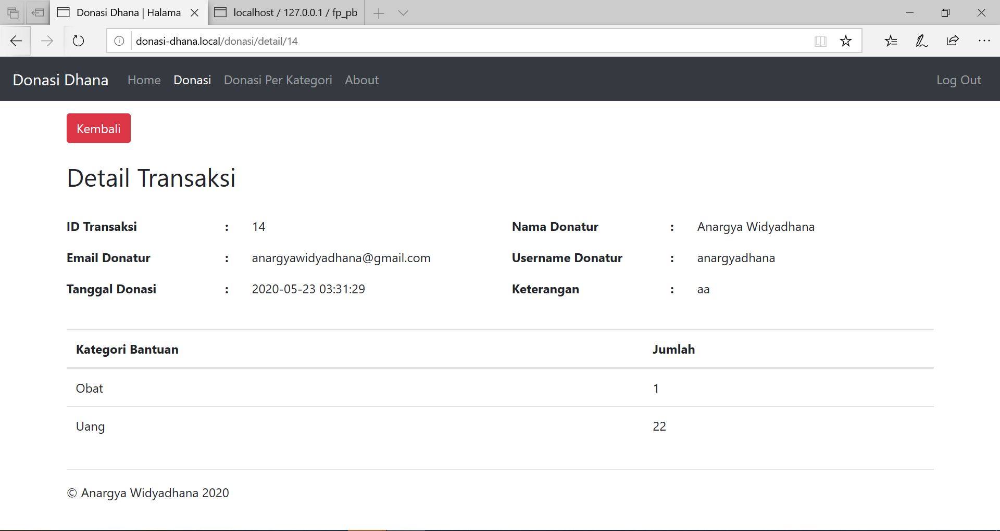
Pada halaman ini, ditampilkan data user donatur, dan data donasi per jenis bantuan yang diberi, pada satu transaksi. Jenis barang dan jumlah yang ditampilkan adalah dinamis sesuai yang diisikan user saat membuat donasi, jika tidak mengisi pada kategori tersebut maka tidak ditampilkan dalam transaksi ini.

#### 7. Halaman Tambah Donasi
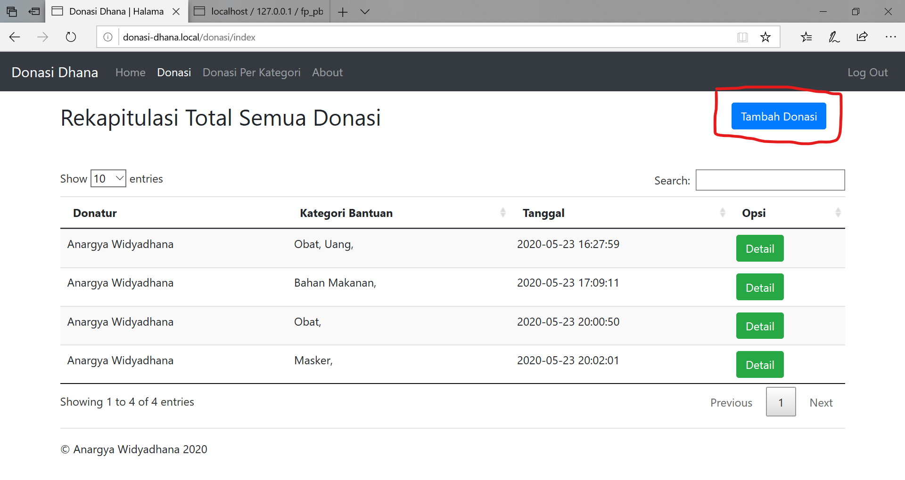
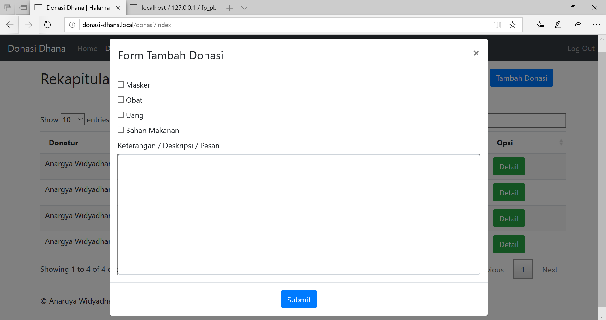

Ini adalah form penambahan donasi. Per kategori bantuan dibuat sebagai checklist, yang artinya bisa dipilih satu atau banyak kategori. Form untuk jumlah per kategori dibuat dinamis, dengan form akan muncul atau hilang saat dichecklist atau tidak dichecklist. Contohnya sebagai berikut.
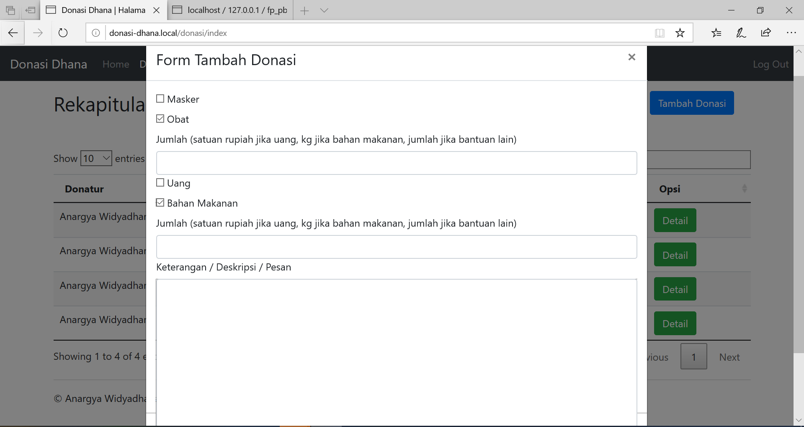
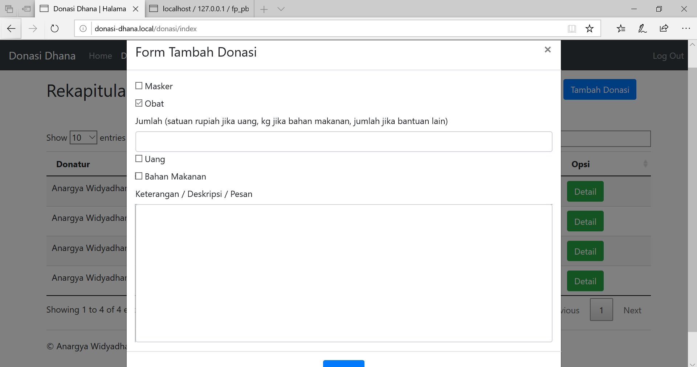

Form di sini juga dinamis, artinya jika terdapat penambahan kategori baru dari database, form di sini juga ikut bertambah sesuai dengan jumlah kategori bantuan yang ada.

Berikutnya ada textarea untuk mengisi keterangan, bisa diisi sebagai kalimat pesan melalui donasi ini, harapan dari melakukan donasi, dsb. Contoh pengisian form lengkap sebagai berikut.

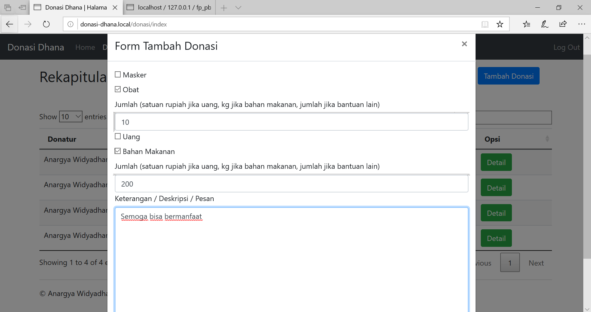

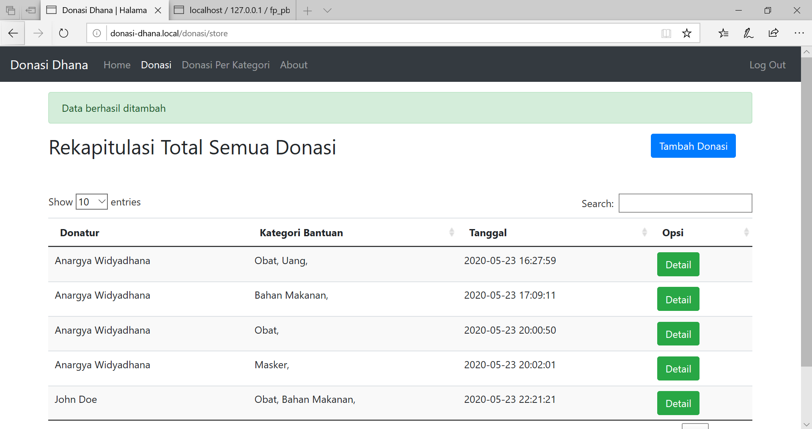

#### 8. Halaman Donasi Per Kategori
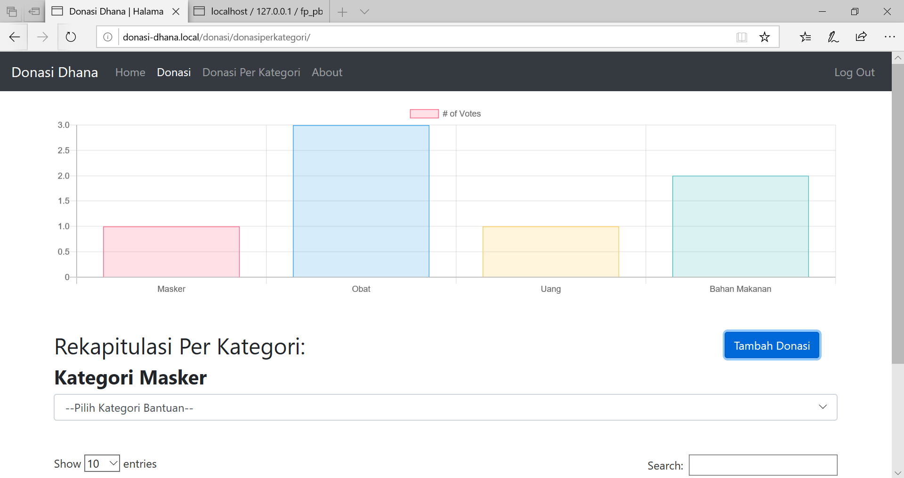
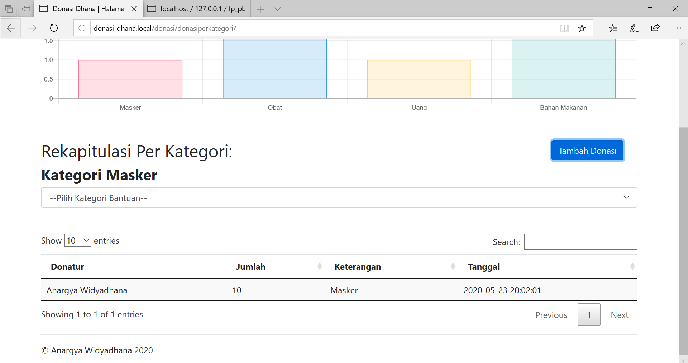
Pada halaman ini, bisa dilihat rekapitulasi donasi yang dilakukan semua orang berdasarkan kategori bantuannya. Pada sebelah atas, ada grafik yang menunjukkan perbandingan jumlah data pada setiap kategori. Grafik dibuat menggunakan `Chart.js`. Pada halaman agak ke bawah muncul Kategori yang sekarang sedang difilter, dan tabel dengan isi sesuai dengan jenis bantuan yang diberi. Berbeda dari rekapitulasi semua donasi, pada tabel ini, data didasarkan dari tabel `detail_transaksi` dari database. Hal ini karena untuk membedakan, bisa saja setiap orang mempunyai banyak kategori/jenis bantuan yang diberikan.

Sementara untuk memilih kategori terdapat pada select dropdown di bawah judul kategori. Saat memilih akan langsung diredirect menuju halaman yang sama namun dengan filter sesuai yang dipilih, tanpa perlu menekan tombol lagi. Berikutnya, dari sini juga bisa dilakukan tambah donasi, sama persis dengan halaman tambah donasi sebelumnya.

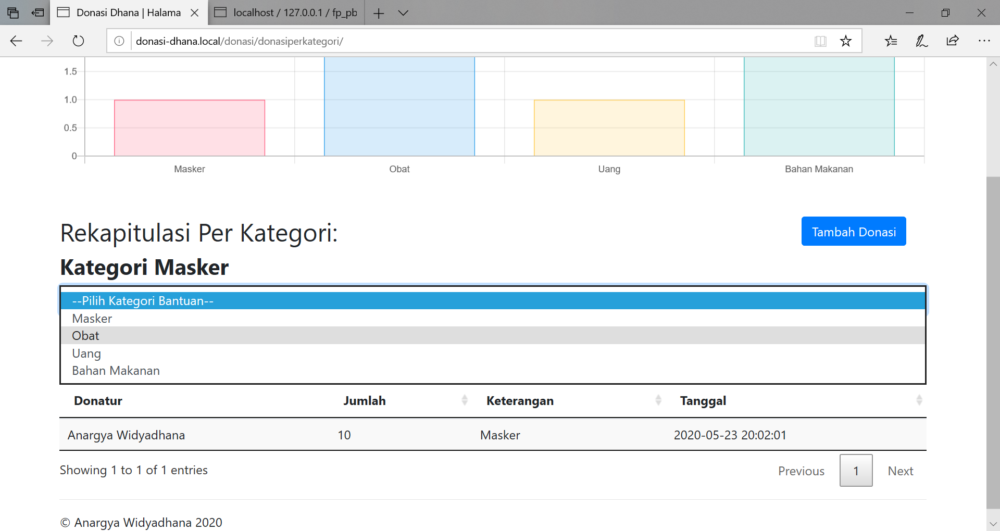
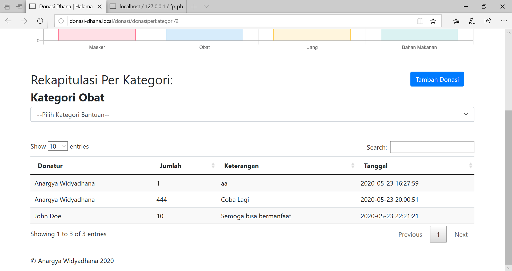
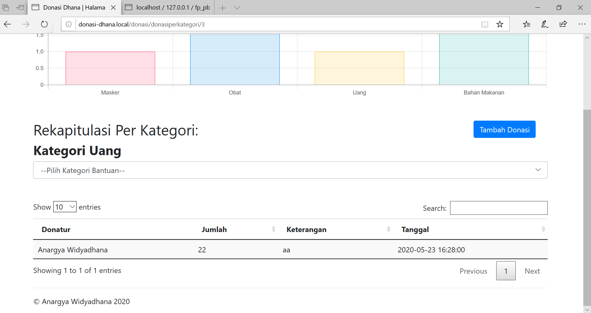
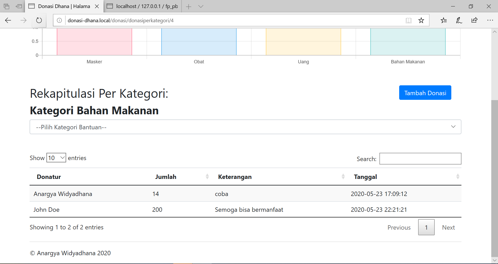

#### 9. Logout
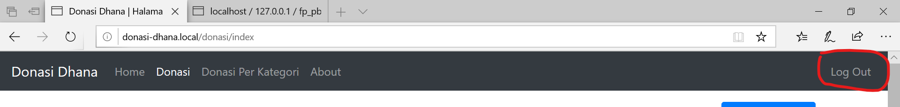
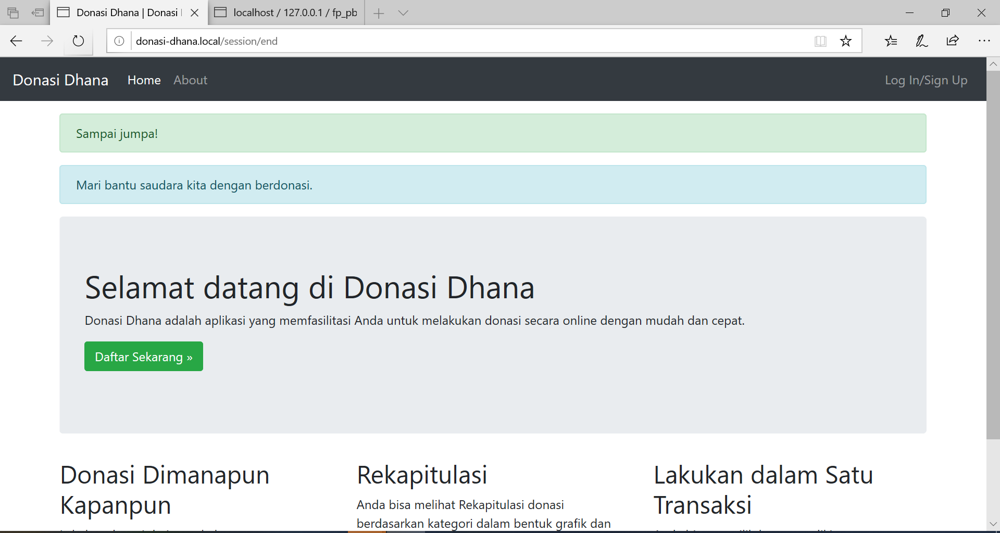

Jika diklik akan menghapus session auth dan meredirect ke halaman home.