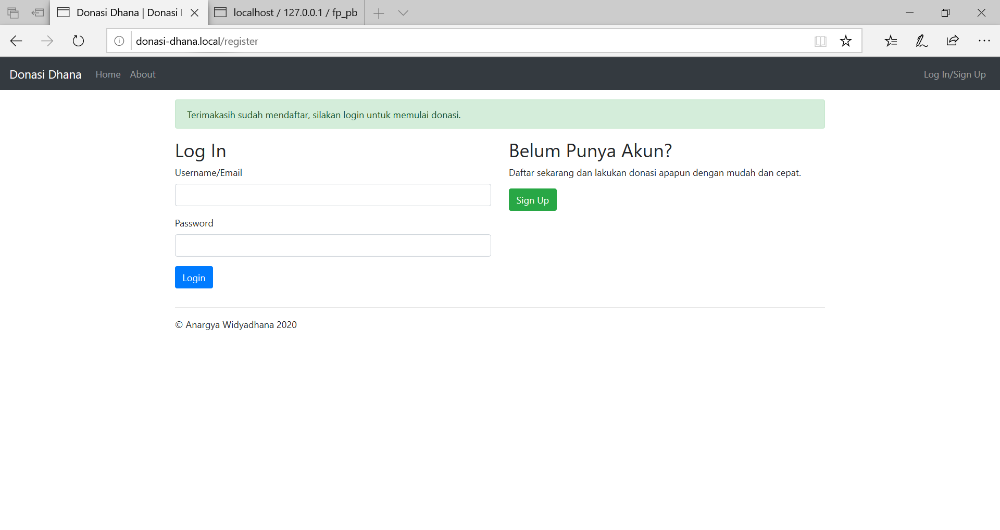

# UAS Pemrograman Berbasis Kerangka Kerja

Nama          : Anargya Widyadhana

NRP           : 05111740000047

Mata kuliah   : Pemrograman Berbasis Kerangka Kerja

Kelas         : E

## Status Pengerjaan
Dokumentasi belum selesai, web sudah selesai. (Updated on 23/05/2020 21:56)

## Instalasi
- Pertama, lakukan clone project ini.
- Sesuaikan setting database pada file `app/config/config.php` sesuai dengan database kalian.
- Lakukan migrasi tabel dengan `phalcon migration run`. Jika tidak bisa harap sesuaikan migration dengan versinya, versi terbaru adalah `1.0.2` di folder `app/migrations`.
- Lalu, kalian bisa membuat virtual host pada Web Server yang digunakan (untuk kali ini saya menggunakan Apache pada XAMPP Windows, dengan nama domain `donasi-dhana.local`). (opsional)
- Buka aplikasi di browser.

## Penjelasan Aplikasi
Donasi Dhana adalah aplikasi web dengan menggunakan framework Phalcon. Di sini digunakan `Phalcon Devtools` dalam membuat project aplikasinya. Aplikasi menggunakan template `Bootstrap`. Dalam aplikasi ini, terdapat sebuah fitur donasi, yaitu pengguna bisa melakukan registrasi pada aplikasi, melihat rekapitulasi semua donasi oleh semua user, melihat detail donasi dari daftar rekapitulasi tersebut, membuat donasi baru dengan dinamis (bisa banyak atau sedikit jenis barang dalam donasi), dan melihat detail donasi per kategori, dalam format tabel dan grafik.

## Penjelasan Fitur
#### 1. Halaman Home/Main Aplikasi

Pada halaman ini, pengunjung bisa melihat halaman utama saat aplikasi dijalankan/web dibuka. Terdapat navbar di atas, berisi `Home` (menu ini), `About`, `Log In/Sign Up`. Dan terdapat petunjuk mengenai aplikasi di sini.

#### 2. Halaman About

Pada halaman ini, pengunjung bisa melihat profil dari pembuat yaitu saya sendiri.

#### 3. Halaman Login

Di sini, pengunjung bisa login untuk dapat melakukan donasi dan melihat menu-menu berikutnya. Jika belum mempunyai akun, bisa mendaftar di tombol `Sign Up`.

#### 4. Halaman Register

Di sini, pengunjung bisa mengisi form untuk melakukan pendaftaran. Setelah mendaftar akan meredirect ke halaman `Login` dan menampilkan pesan flash success.

Untuk halaman-halaman selanjutnya, hanya bisa diakses setelah login, jika tidak maka akan otomatis meredirect ke halaman `Home`. Proses pengecekan auth dan redirect dilakukan di controller.

#### 5. Halaman Rekapitulasi Semua Donasi

Di sini adalah halaman pertama yang muncul setelah proses login. Halaman ini menampilkan rekapitulasi semua donasi oleh semua user terdaftar pada aplikasi. Pada tabel, data disusun berdasarkan tiap-tiap transaksi, yang menunjukkan nama donatur, kategori yang dipilih, tanggal donasi, dan detail dari donasi tersebut. Pada tabel bisa dilakukan pencarian, pengurutan berdasarkan kolom-kolom, dan paging, karena menggunakan fitur `Datatables`.